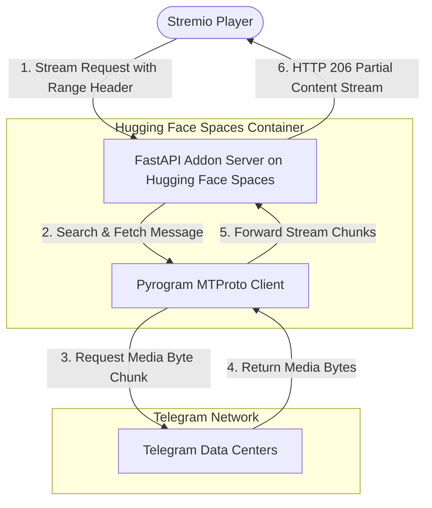

# Telegram Stremio Addon


[](LICENSE)
[](https://huggingface.co/spaces)
[](https://www.docker.com/)

Stream video, audio, and subtitle files directly from your private Telegram storage channels inside **Stremio**. This addon operates as a high-speed on-the-fly streaming HTTP proxy (fully supporting HTTP 206 Range Requests for instant seek/scrubbing) that integrates your private Telegram channel into your personal Stremio library.

---

## ⚡ Why Host on Hugging Face Spaces?

Hosting on Hugging Face Spaces provides the best free cloud hosting experience for your personal Telegram Stremio addon:

* **100% Free**: Generous free CPU tier (2 vCPU, 16 GB RAM) with zero credit card required at sign up.
* **Permanent HTTPS URL**: Built-in permanent SSL URL (`https://<username>-<space-name>.hf.space`) with zero tunnels, domains, or port-forwarding required.
* **Fast Streaming**: High-speed Gigabit networking powered by data centers with C-based `tgcrypto` encryption.
* **Generous Bandwidth**: Generous bandwidth for streaming video backups without hitting tight monthly quotas (like Render's 5 GB limit).
* **Docker Isolation**: Runs cleanly in an isolated container on port 7860 with user ID 1000.
* **Optional Auto-Update**: Space can automatically sync and pull the latest code updates on every restart when `AUTO_UPDATE=true` is set.

---

## 🚀 Complete Step-by-Step Hugging Face Hosting Guide

Follow these simple steps to deploy your addon 24/7 on Hugging Face Spaces in less than 5 minutes:

### Step 1: Fork or Clone This Repository
Click the **Fork** button at the top-right of this repository to create your own copy on GitHub.

---

### Step 2: Get Your Telegram API Credentials
1. Go to **[my.telegram.org](https://my.telegram.org)** and log in with your phone number.
2. Click **API development tools**.
3. Create a new application (you can enter any app title and short name).
4. Copy your **`API_ID`** (a number) and **`API_HASH`** (a 32-character string).

---

### Step 3: Generate Your Pyrogram `USER_SESSION_STRING`

A User Session String lets the addon stream files up to **4 GB** (bypassing the 2 GB bot limit).

> [!CAUTION]
> **Never commit your session string to public files or git commits.** Only store it in your Hugging Face Space Secrets (Step 5).

Choose the easiest method below to generate your session string:

#### Option A: Run on Mobile (via Google Colab — No App Install Needed)
1. Open **[colab.new](https://colab.new)** in your mobile web browser (log in with Google).
2. Click **+ Code**, paste the code below, and press the **Play (▶)** button:
   ```python
   !pip install pyrogram tgcrypto
   import asyncio
   from pyrogram import Client
   api_id = int(input('API ID: '))
   api_hash = input('API HASH: ')
   async def main():
       async with Client('temp_session', api_id, api_hash) as app:
           print('\nYour USER_SESSION_STRING is:\n')
           print(await app.export_session_string())
   asyncio.run(main())
   ```
3. Enter your `API_ID`, `API_HASH`, phone number with country code (e.g. `+1234567890`), and the login code sent to your Telegram app.
4. Copy the generated `USER_SESSION_STRING`.

#### Option B: Run on Local PC (Terminal)
Run this one-liner in your terminal:
```bash
python3 -c "import asyncio; from pyrogram import Client; api_id = int(input('API ID: ')); api_hash = input('API HASH: '); asyncio.run(Client('temp_session', api_id, api_hash).export_session_string())"
```

---

### Step 4: Create a New Space on Hugging Face

1. Log in or create a free account at **[huggingface.co](https://huggingface.co/)**.
2. Go to **[huggingface.co/new-space](https://huggingface.co/new-space)**.
3. Configure your Space:
   - **Space name**: Choose any name (e.g., `telegram-stremio`).
   - **License**: `mit` or `other`.
   - **Space SDK**: Select **Docker**.
   - **Template**: Choose **Blank**.
   - **Space Hardware**: Select **CPU basic · 2 vCPU · 16 GB · Free**.
   - **Space Visibility**: Select **Public** (required for the free CPU tier).
4. Click **Create Space**.

---

### Step 5: Deploy Code to Your Space

Choose either deployment method below:

#### Option A: Deploy via Git (Recommended)
From your local terminal, add your Hugging Face Space as a git remote and push:
```bash
git remote add space https://huggingface.co/spaces/<YOUR_HF_USERNAME>/<YOUR_SPACE_NAME>
git push --force space main
```
*(When prompted for credentials, use your Hugging Face username and your [Hugging Face User Access Token](https://huggingface.co/settings/tokens) with `write` permission as password).*

#### Option B: Deploy via Hugging Face Web UI
1. On your GitHub repository fork, click **Code** → **Download ZIP** and extract it on your computer.
2. Open your Hugging Face Space page, click the **Files** tab → **+ Add file** → **Upload files**.
3. Drag and drop all project files into the upload box (ensure `Dockerfile`, `addon.py`, `requirements.txt`, etc. are placed in the root of the Space, not in a subfolder).
4. Click **Commit changes to main**. Hugging Face will automatically begin building the Docker container!

---

### Step 6: Configure Environment Secrets

1. Open your Space on Hugging Face and click the **Settings** tab.
2. Scroll down to the **Variables and secrets** section.
3. Under **Secrets**, click **New secret** and add your configuration:

| Secret Name | Required | Description | Example |
| :--- | :---: | :--- | :--- |
| `API_ID` | **Yes** | Telegram API ID from my.telegram.org | `12345678` |
| `API_HASH` | **Yes** | Telegram API Hash from my.telegram.org | `a1b2c3d4e5f6...` |
| `USER_SESSION_STRING` | **Yes** | Pyrogram Session String (from Step 3) | `1BJWX...` |
| `BOT_TOKEN` | Optional | Telegram Bot Token from @BotFather (if not using User Session) | `123456:ABC-DEF...` |
| `API_KEY` | Optional | Secret password of your choice to protect your addon | `mysecretkey123` |
| `TELEGRAM_CHANNEL_ID` | Optional | Specific channel ID(s) or @username to index (comma-separated) | `-1001234567890` |
| `LOG_CHANNEL_ID` | Optional | Telegram channel ID where playback activity logs are sent | `-1009876543210` |
| `ADDON_URL` | Optional | Your public Space URL (automatically detected if omitted) | `https://username-space.hf.space` |
| `AUTO_UPDATE` | Optional | Set to `true` to auto-pull latest updates from GitHub on startup | `true` |
| `GITHUB_REPO_URL` | Optional | Custom fork repo to pull updates from if `AUTO_UPDATE=true` | `https://github.com/deepu2135/telegram-stremio.git` |

4. After saving secrets, Hugging Face will automatically restart your container.

---

### Step 7: Get Your Stremio Addon URL & Install

1. In your Hugging Face Space, check the status badge at the top. Once it turns green and shows **Running**:
2. Access your addon configuration web interface:
   ```text
   https://<YOUR_HF_USERNAME>-<YOUR_SPACE_NAME>.hf.space/
   ```
   *(You can also find your direct URL by clicking the three dots `...` in the top-right of your Space → **Embed this Space** → **Direct URL**).*
3. If configured, enter your `API_KEY` and click **Install on Stremio App** (or **Install on Stremio Web**).
4. Stremio will open and prompt you to install your addon!
   - Alternatively, copy the Manifest URL (`https://<YOUR_HF_USERNAME>-<YOUR_SPACE_NAME>.hf.space/manifest.json?api_key=...`) and paste it directly into the search bar in Stremio's **Add-ons** section.

---

## 🔑 Key Features

* **Instant Search & Match**: Search any movie, anime, or series title in Stremio; the addon searches your Telegram channels and returns matching video streams instantly.
* **Stitched Split Streaming**: Automatically groups, merges, and streams multi-part file archives (such as `.001`, `.002`, `.part1.rar`, etc.) as one continuous virtual stream.
* **ZIP Archive Streaming**: Automatically scans, lists, and streams video files nested inside ZIP archives on the fly.
* **Smart Segment Filtering**: Intelligently parses naming patterns and number sequences (e.g. Part 1, Part 2, V1, V2) from filenames to retrieve and stream only the exact segmented file requested.
* **Subtitle Auto-Mapping**: Automatically detects and injects matching subtitle files (`.srt`, `.vtt`, `.ass`) with language tagging (English, Spanish, French, etc.).
* **HTTP 206 Range Requests**: Full byte-range seeking/scrubbing support for instant rewinding and fast-forwarding on ExoPlayer, VLC, and MPV.
* **Zero Storage Overhead**: Video bytes are streamed chunk-by-chunk directly from Telegram Data Centers to your media player without consuming local disk space.
* **Security & Access Control**: Protect your addon with an optional `API_KEY` to prevent unauthorized streaming.

---

## 🧩 Stitched Split Streaming

If you have large media files (e.g., 4K HDR video backups) that exceed Telegram's file upload limits (2 GB for bots, 4 GB for user accounts), you can split them into smaller segments before uploading. The addon automatically detects, groups, and stitches them back together into a single virtual stream.

### Supported Split Formats
The addon parses standard split archive conventions including:
* **Numeric extensions**: `Video.mkv.001`, `Video.mkv.002`, `Video.mkv.003`...
* **Part indicators**: `Video.part1.rar`, `Video.part2.rar`, `Video.part3.rar`... (or `.part01.mkv`, `.part02.mkv`...)
* **Suffix delimiters**: `Video_part_1.mp4`, `Video_part_2.mp4`...

### How It Works Under the Hood
1. **Aggregation**: The catalog handler parses filename patterns and clusters split files together, presenting them as a single item with their total combined file size (e.g., `Stitch stream | 6.2 GB`).
2. **Dynamic Range Mapping**: When you press play or seek in Stremio, the addon maps the player's byte-range requests to the respective split files on the fly.
3. **In-Memory Sequential Access**: It downloads only the necessary segments from Telegram DCs and transitions between split messages seamlessly in memory, resulting in uninterrupted playback.

---

## 📦 ZIP File Support

You can upload `.zip` files (or split ZIP files like `.zip.001`, `.zip.002`, etc.) to your Telegram channel. The addon will automatically scan inside the ZIP, find all video files, and list them in Stremio so you can play them directly!

> [!IMPORTANT]
> **Skipping/Seeking within ZIP archives is not recommended**:
> To seek within a compressed ZIP file, the server must decompress stream chunks sequentially from the beginning of the file. For instant seeking and smooth scrubbing, upload media directly as video files (`.mkv`, `.mp4`) or numeric split video files (`.001`, `.002`).

---

## 📂 Naming and Matching Guide

To ensure the addon accurately matches your Telegram files with Stremio metadata, follow standard release naming conventions:

```text
[Title Name] [Season/Episode Info] [Quality/Extra Tags].mkv
```

### Examples:
* **Series**: `Naruto S01E02 [1080p] [Dual Audio].mkv`
* **Movies**: `Inception 2010 1080p BluRay.mkv`
* **Split Files**: `Avatar.2009.2160p.mkv.001`, `Avatar.2009.2160p.mkv.002`

---

## 🏗️ System Architecture



---

## ⚙️ Configuration Variables Reference

| Variable | Required | Description | Default |
| :--- | :---: | :--- | :--- |
| `API_ID` | **Yes** | Your Telegram API ID from [my.telegram.org](https://my.telegram.org). | — |
| `API_HASH` | **Yes** | Your Telegram API Hash from [my.telegram.org](https://my.telegram.org). | — |
| `USER_SESSION_STRING` | **Yes** | Pyrogram Session String (enables streaming up to 4GB files). | `""` |
| `BOT_TOKEN` | No | Telegram Bot Token from @BotFather (fallback if no user session, 2GB limit). | `""` |
| `API_KEY` | No | Secret password to protect your addon endpoints (`?api_key=...`). | `""` |
| `ADDON_URL` | No | Public base URL of your deployed Space (auto-detected via request headers). | `http://localhost:7860` |
| `AUTO_UPDATE` | No | Set to `true` to auto-pull latest repository code on container start. | `false` |
| `GITHUB_REPO_URL` | No | GitHub repository URL to pull updates from if `AUTO_UPDATE` is `true`. | `https://github.com/deepu2135/telegram-stremio.git` |
| `TELEGRAM_CHANNEL_ID` | No | Comma-separated list of channel IDs or usernames to index (`-100..., @channel`). | All joined dialogs |
| `LOG_CHANNEL_ID` | No | Telegram channel ID where playback activity logs are sent. | `""` |
| `CACHE_TTL` | No | Search query cache duration in seconds. | `1800` (30 mins) |
| `PARALLEL_CONNECTIONS` | No | Number of parallel chunk workers for streaming throughput. | `3` |
| `TIMEZONE` | No | Timezone for logs. | `UTC` |
| `PORT` | No | Server listen port. | `7860` |

---

## 💻 Local Installation & Docker Setup

If you wish to test or run the addon locally on your computer or VPS:

### Option A: Local Python
1. Clone the repository and navigate into it:
   ```bash
   git clone https://github.com/deepu2135/telegram-stremio.git
   cd telegram-stremio
   ```
2. Create a virtual environment and install dependencies:
   ```bash
   python3 -m venv .venv
   source .venv/bin/activate  # On Windows: .venv\Scripts\activate
   pip install --upgrade pip
   pip install -r requirements.txt tgcrypto
   ```
3. Copy `.env.example` to `.env` and fill in your Telegram API credentials:
   ```bash
   cp .env.example .env
   ```
4. Run the server:
   ```bash
   python3 addon.py
   ```
   Access the dashboard at `http://localhost:7860`.

### Option B: Docker Compose
```bash
docker compose up --build
```

---

## 📜 License & Attribution

### MIT Non-Commercial License (MIT-NC)
This project is licensed under a custom **MIT Non-Commercial License (MIT-NC)**. Sublicensing, commercial distribution, renting, or monetization of this software or its derivatives is strictly prohibited. Attribution must be preserved in all copies.

### Disclaimer
This software is developed strictly for **educational, personal backup, and research purposes**. Users are solely responsible for the media files they access in their private Telegram storage channels.
